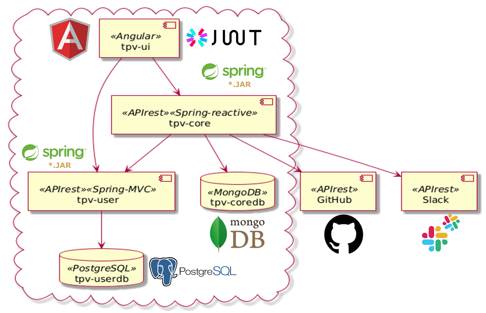
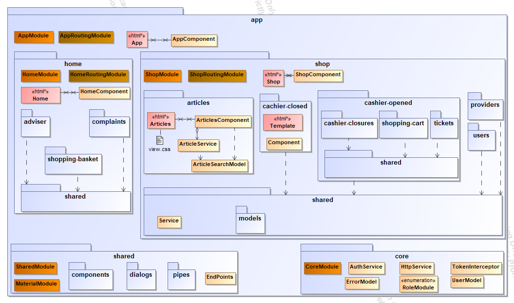
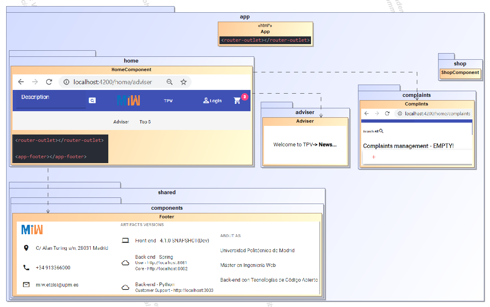
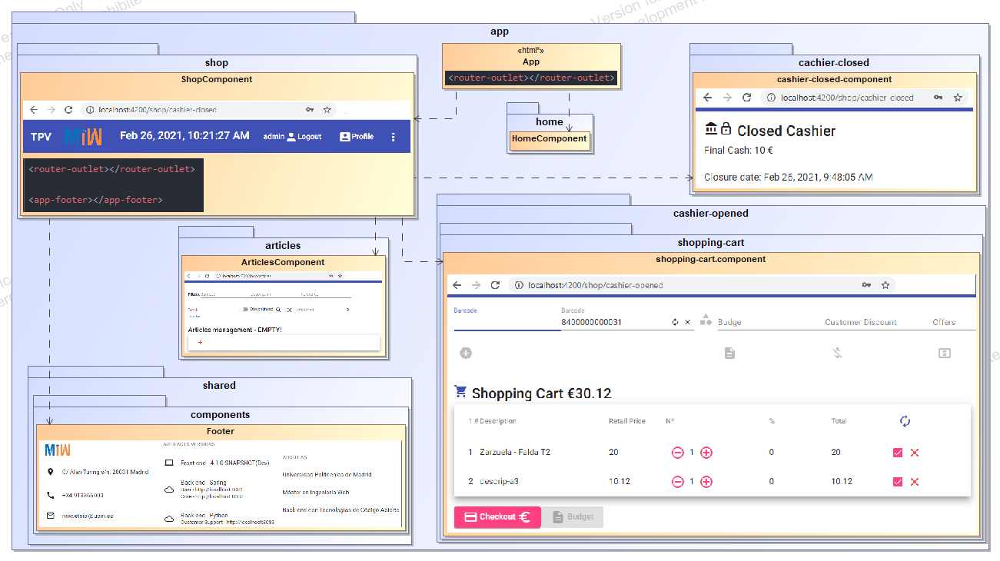
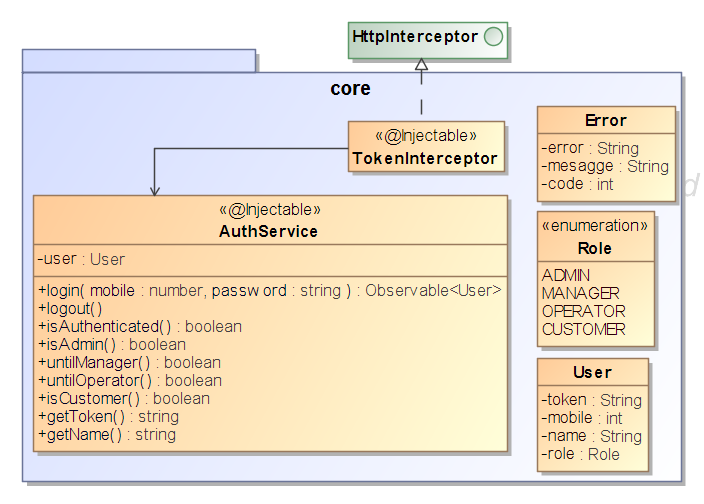
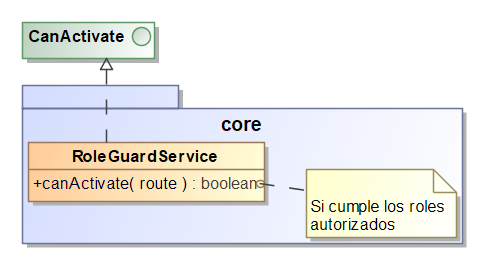

# [Máster en Ingeniería Web por la Universidad Politécnica de Madrid (miw-upm)](http://miw.etsisi.upm.es)
# Back-end con Tecnologías de Código Abierto: **SPRING & PYTHON**
> Proyecto TPV. Este proyecto es un apoyo docente de la asignatura. Es una aplicación completa realizada con un Front-end con Angular, 
dos Back-ends con Spring y un Back-end con Python. El Back-end-user se desarrolla con programación síncrona y Postgresql. El Back-end-core se
 realiza con programación reactiva y MongoDB. El Back-end-customer-support con programación síncrona y MongoDB

## Tecnologías necesarias
`Java` `Maven` `Spring-Boot` `Reactor` `Angular` `MondoDB` `JPA` `SQL` `GitHub` `GitHub Actions` `Sonarcloud` `GitHub packages` `Docker` `Render`

## Estado del código
Proyecto | GitHub - CI                                                                                                                                                                                                            | Sonarcloud
-- |------------------------------------------------------------------------------------------------------------------------------------------------------------------------------------------------------------------------| --
Front-end-angular | [](https://github.com/miw-upm/betca-tpv-angular/actions/workflows/ci.yml)                                           | [](https://sonarcloud.io/dashboard?id=es.upm.miw%3Abetca-tpv-angular)
Back-end-user | [](https://github.com/miw-upm/betca-tpv-user/actions)                                                   | [](https://sonarcloud.io/dashboard?id=es.upm.miw%3Abetca-tpv-user)
Back-end-core | [](https://github.com/miw-upm/betca-tpv-core/actions)                                                   | [](https://sonarcloud.io/dashboard?id=es.upm.miw%3Abetca-tpv-core) 

## :arrow_forward: Aplicación
https://betca-tpv-angular-latest.onrender.com/

## :octocat: Repositorios
* [Front-end-angular](https://github.com/miw-upm/betca-tpv-angular)
* [Back-end-user](https://github.com/miw-upm/betca-tpv-user)
* [Back-end-core](https://github.com/miw-upm/betca-tpv-core)


## :gear: Instalación del proyecto
1. Clonar repositorios, **mediante consola**:

   * betca-tpv-angular
```sh
> cd <folder path>
> git clone https://github.com/miw-upm/betca-tpv-angular
> cd betca-tpv-angular
betca-tpv-angular> docker build -f Dockerfile-dev -t betca-tpv-angular .
betca-tpv-angular> docker run -d -p 4200:4200 --name betca-tpv-angular-app betca-tpv-angular
http://localhost:4200
```
   * betca-tpv-user
```sh
> cd <folder path>
> git clone https://github.com/miw-upm/betca-tpv-user
> cd betca-tpv-user
betca-tpv-user> docker compose up --build -d
http://localhost:8081/swagger-ui.html
http://localhost:8081/actuator/info


```
   * betca-tpv-core
```sh
> cd <folder path>
> git clone https://github.com/miw-upm/betca-tpv-core
> cd betca-tpv-core
betca-tpv-user> docker compose up --build -d
http://localhost:8082/swagger-ui.html
http://localhost:8082/actuator/info
```   

2. Importar el proyecto `betca-tpv-angular` mediante **WebStorm** 
   * **Open**, y seleccionar la carpeta del proyecto.
3. Importar los proyectos `betca-tpv-user` & `betca-tpv-core` mediante **IntelliJ** 
   * **Open**, y seleccionar la carpeta del proyecto.

# :page_with_curl: Enunciado de la práctica
## A. Opción TFM con Spring
> La practica consiste en presentar el principio del proyecto (User + 2 modelos) con **CI & CD**. Deberá tener la funcionalidad completa de manejo de **User: registrar, logearse, manejar el perfil y opcionalmente recuperar la contraseña**.  
> **Tecnología obligatoria: Back-end con _Spring_ & resto libre.**
> 
## B. Opción TPV
> La practica consiste en ampliar de forma colaborativa una aplicación web: **TPV**.  
> **NOTA. Todo el software deberá estar en ingles.**

### 1. Requisitos de la práctica
Los requisitos se obtiene aleatoriamente entre los posibles existentes: https://github.com/miw-upm/betca-tpv/wiki.   

La metodología se desarrolla en el proyecto: https://github.com/users/miw-upm/projects/8, de forma centralizada para
todos las historias.
> IMPORTANTE: recordar que en los mensajes de los comits se debe añadir: `miw-upm/betca-tpv#xxx`.  

La historia debe organizarse en `tareas` mas pequeñas, cada una de ella asociada a un `issue`. Asignar el Hito. 
Justo antes de empezar una tarea, asignar la estimación de tiempo: puntos y el typo de tarea. Al finalizar una tarea, asignarle el tiempo
consumido y cerrarla. Una tarea puede incluir tocar parte de varios repositorios: angular y core, pero se maneja el mismo número de rama en ambos.  

Utilizar un flujo de trabajo ramificado, visto en IWVG: Ecosistema o APAW.  

### 2. Sprint 1: Interfaz de Usuario
> Se debe cerrar en los primero 7 dias.   
El primer `issue` es realizar el **Interfaz de Usuario** en Angular, asociarlo al hito `Evaluación: Interfaz de Usuario`, 
con valores mock y sin atacar a los API.   
Una vez finalizado, y antes de cerrarlo, se debe avisar al profesor mediante Slack, en un hilo privado, 
hasta que el profesor de por correcto el UI.

### 3. Sprint 2: Finalización de la Práctica
El resto de la práctica se realizarán con los `issues` que se consideren necesarios, se recomienda entre 5-10. A modo de ejemplo,
se propone una posible división:
* Tarea (2..5). Una tarea por cada parte del enunciado diferenciada.
* Tarea. Creación de entidades o modelos en BD.
* Tarea. Refactorizar, reoordenar, simplificar...
* Tarea. Bugs encontrados en la pruebas de aceptación.

## Tareas transversales
* Planificar antes los cambios a realizar, y cuando se tiene claro, actualizar la rama **issue#xx** con **develop** justo antes de empezar. 
Realizar una **estimación temporal** y **anotarlo en la tarea**.
* Cuando nos sentamos a trabajar, comprobar que la rama **issue#xx** está actualizada respecto a **develop**.
* No es recomendable dejar de trabajar sin aportar a develop las mejoras, siempre **sin romper develop**.
* Realizar aportaciones frecuentes a la rama **develop**, del código estable, aunque este a medias. 
**Ojo** con los ficheros muy susceptibles de colisionar, como por ejemplo **app.module.ts**, **app-routing.module.ts**, 
**home.component.ts**..., en este caso, modificarlos y subirlos a **develop** con rapidez.
* Vigilar y pensar bien los **comentarios de los commits**, acordarse de añadir la referencia del issue: **#xx**.
* Cuando se termina una **tarea** o **issue#xx**, añadir el **tiempo real** utilizado y cerrarlo.

# :white_check_mark: Criterios de evaluación
* Errores típicos
   * **En el cuerpo de las peticiones/respuestas no pueden viajar tipos nativos**.
   * **Las peticiones, independiente del tipo (recursos, servicios, persistencias), se colocan en los tipos devueltos**.
   * **No se debe delegar en la persistencia toda la lógica de negocio. La persistencia debiera realizar sólo funciones básicas de sus entidades asociadas.**  
   * **Filosofía de los _`find***By***`_**.
   * **Los métodos de un objeto, normalmente leen o alteran el estado.**
   * **En el modelo del dominio, normalmente se tienen que distinguir de alguna manera los objetos, aunque no es obligatorio, y debe ser independiente a la _id_, ya que esta es de la capa de persistencia.**
* Uso correcto del flujo de trabajo ramificado. **Hasta -2 ptos**. Los **warning** son avisos sin perdida de puntos.
* Adecuación de la temporalidad de desarrollo según el enunciado. **Hasta -4 ptos**.
* No se puede realizar un **findAll** y luego filtrar por código, se debe utilizar adecuadamente las **queries**.
Las búsquedas, a cualquier nivel, resource, service, repository... siempre se coloca en el tipo devuelto. **Hasta -2 ptos**
* Cobertura total >= 80%, cobertura de end-points = 100% (>90% código) , cobertura de servicios = 100% (>90% código). **Hasta -2 ptos**
* Mantenimiento de calidad del código según Actions-CI y Sonar. Cuando IntelliJ subraya en naranja: OJO!!! puede ser 
un indicio de un error cometido. Todos los aspectos vistos en teoría, y poniendo espeacial enfásis en:
   * Formatear.
      * Herramienta del IDE.
      * Líneas en blanco.
      * Ordenar métodos.
      * Repasar nombres de clases, métodos, atributos, parámetros y variables.
   * Sencillez del código.
      * Simplificar el código.
      * Eliminar comentarios.
      * Estructuras anidadas: <3.
      * Complejidad ciclomática: <8-12.
   * Métricas.
      * Paquete: <20 clases.
      * Clases: <500-200 líneas, <20 métodos.
      * Métodos: <3-4 parámetros, <15 líneas.
   * Eliminar redundancias (copy & paste).
   * Eliminar código muerto.
   * Tratamiento de errores. 
   * Calidad de la arquitectura (GRASP, SOLID, **patrones**...).
* Gestión adecuada, completa y equilibrada (estimación, tiempo real...) durante el desarrollo. **Hasta -3 ptos**. 
* Uso del ingles. **Hasta -1 pto**.

# :clap: Entraga de la práctica
Indicar como texto en la subida:
* Nombre de la história.
* Cuenta de github.
* Valor del nombre que aparece en los commits del autor.
* Número del último commit y fecha del mismo (dÍa-hora).
* Tiempo total estimado, tiempo total real utilizado.
* Número de líneas de código de Angular & Nª de Spring.
* Producción: número de líneas/hora de Angular & líneas/hora de Spring.

# :book: Documentación del proyecto
> Este proyecto es la práctica TPV desarrollada de forma colaborativa por todos los alumnos. Se parte de la versión `core`,
ya implementada, y se pretende ampliar con un conjunto de mejoras. Un **T**erminal **P**unto de **V**enta
es un sistema informático que gestiona el proceso de venta mediante una interfaz accesible para los vendedores o compradores.
Permite la creación e impresión del recibo ticket o factura de venta —con los detalles de las referencias y precios— de los artículos vendidos,
actualiza los cambios en el nivel de existencias de mercancías (STOCK) en la base de datos... Además tiene la parte de venta on-line.

## Interfaz de Usuario
* [App TPV desplegada en Render](https://betca-tpv-angular-lastest.onrender.com)



## Front-end: Angular
### Carpetas




### Seguridad



### Código

#### Uso del Pipe `async`

```html
<p><button mat-raised-button (click)=requestSync() >Sync </button> {{sync}}</p>
<p><button mat-raised-button (click)=requestAsync()>Async</button> {{asyn | async}}</p>
```
```typescript
export class InputOverviewExample {
  sync: string;
  asyn: Observable<string>;
  requestSync(): void {
    this.serviceMock()
    .subscribe(item => this.sync = item);
  }
  requestAsync(): void {
     this.asyn = this.serviceMock();
  }
  serviceMock(): Observable<string> {
    return of('Result');
  }
}
```

### Servicios mock
```typescript
export class ArticleService {
  create(article: Article): Observable<Article> {
    return of(article);
  }
  read(barcode: string): Observable<Article> {
    return of({barcode: barcode, description: '...', retailPrice: 10, providerCompany: 'pro1'})
  }
  search(articleSearch: ArticleSearch): Observable<Article[]> {
    return of([
      {barcode: 123, description: '...', retailPrice: 10, providerCompany: 'pro1'},
      {barcode: 345, description: '...', retailPrice: 10, providerCompany: 'pro2'},
      {barcode: 678, description: '...', retailPrice: 10, providerCompany: 'pro1'}
    ])
  }
```

### Componentes con atributos y eventos
`my-comp.component.html`
```html
<p>Hello {{user}}! <input type="button" value="Ok" (click)="onClick()"></p>
```
```typescript
import { Component, EventEmitter, Input, Output } from '@angular/core';
@Component({ selector: 'app-my-comp', templateUrl: './my-comp.component.html' })
export class MyCompComponent {
   @Input() user = 'By default';
   @Output() pressed = new EventEmitter<string>();
   onClick(){
      this.pressed.emit(this.user)
   }
}
```
`Utilización:`
```html
<app-my-comp></app-my-comp>
<app-my-comp user="Value"></app-my-comp>
<app-my-comp [user]=user></app-my-comp>
<app-my-comp user="With event" (pressed)="onPressed($event)"></app-my-comp>
```

```typescript
export class AppComponent  {
  user = "Variable";
  onPressed(value:string){
    alert(value);
  }
}
```

### Crud Component
```html
<app-crud (create)="create()" (read)="read($event)" (update)="update($event)"
          [data]="articles" [deleteAction]="false" [title]="title"></app-crud>
```
```typescript
export class ArticlesComponent {
  title = 'Articles management';
  articles = of([]);
  create(): void {
    this.dialog.open(ArticleCreationUpdatingDialogComponent);
  }
  read(article: Article): void {
    this.dialog.open(ReadDetailDialogComponent, {
      data: {
        title: 'Article Details',
        object: this.articleService.read(article.barcode)
      }
    });
  }
  update(article: Article): void {
    this.articleService.read(article.barcode)
      .subscribe(fullArticle => this.dialog.open(ArticleCreationUpdatingDialogComponent, {data: fullArticle}));
  }
}
```

---

# Preparación y actualización del proyecto de Angular con Despliegue Continuo

## Instalaciones de herramientas
1. Desinstalar node & borrado de carpetas, si procede:
   * C:\Users\*\AppData\Roaming\npm
   * C:\Users\*\AppData\Roaming\npm-cache

2. Instalar Node, todo estándar (viene con npm)
   * node  --version  ?`v22.13.1`
   * npm –version ?`10.92.2`
   * npm install -g npm@latest `11.1.0`
   * npm list ?muestra todas las dependencias instaladas
   * npm list &lt;dependence> ?muestra la dependencia especificada
   
3. Instalar Angular CLI
   * npm install -g @angular/cli 
   * ng –-version ?`19.1.6`

4. Crear una nueva aplicación
   * ng new &lt;app>. CSS & N (SSR y SSG)

5. Ejecutar aplicación:
   * cd &lt;app>
   * ng serve
   * Navegador: http://localhost:4200/

6. Instalar Material
   * ng add @angular/material  ?(Tema, Yes, Yes & enable animations)
   * npm list @angular/material ?`19.1.3`
   
7. Instalar Jwt
   * npm i @auth0/angular-jwt
   * npm list @auth0/angular-jwt ?`5.2.0`

8. Para producción, puede ser una buena solución: nginx  (https://nginx.org/es) un servidor de codigo abierto de archivos estáticos
    * Necesita de un fichero de configuración en el raiz del proyecto: 'nginx.config'

#### Versionado: **nginx.config**
```txt
server {
  listen 80;
  server_name localhost;
  root /usr/share/nginx/html;
  index index.html;
  location / {
    try_files $uri /index.html;
  }
  error_page 404 /index.html;
  # Compresión Gzip
  gzip on;
  gzip_types text/plain text/css application/json application/javascript text/xml application/xml application/xml+rss text/javascript;
  gzip_vary on;
}
```

8. Otra solución para producción puede ser express sobre node, es mas pesado...
  * npm i express
  * npm list express ?`4.21.2`
  * Crear el fichero `server.js`
  * ng build --configuration production
  * node server ?arrancar express
  * necesita del fichero `node.js` en el raiz del proyecto

####  **node.js**
```javascript
const express = require('express');
const http = require('http');
const path = require('path');
const app = express();
const server = http.createServer(app);
const PATH_PROJECT = path.join(__dirname, 'dist', 'betca-tpv-angular','browser');
app.use(express.static(PATH_PROJECT));
app.get('*', (req, res) => {
  res.sendFile(path.join(PATH_PROJECT, 'index.html'));
});
const PORT = process.env.PORT || 8080;
server.listen(PORT, () => {
  console.log(`🚀 Servidor corriendo en: http://localhost:${PORT}`);
});
```

Otros comandos
* `>ng serve` for a dev server. Navigate to `http://localhost:4200/`. The app will automatically reload if you change any of the source files.
* `>ng build` to build the project. The build artifacts will be stored in the `dist/` directory. Use the `--prod` flag for a production build.
* `>ng test` to execute the unit tests via [Karma](https://karma-runner.github.io).
* `>ng e2e` to execute the end-to-end tests via [Protractor](http://www.protractortest.org/).
* `>ng help` or go check out the [Angular CLI Overview and Command Reference](https://angular.io/cli) page.

#### Versionado: **package.json**
```json
{
  "name": "betca-tpv-angular",
  "version": "4.10.0-SNAPSHOT", 
}
```
`~: versión mas cercana posible, ^: versión compatible mas alta`
#### Perfil: **carpeta _environments_**

En el fichero `tsconfig`, habilitar las opciones de compilación siguientes, esto nos permite importar valores de los ficheros *.json.
```json
{
  "compilerOptions": {
    "resolveJsonModule": true,
    "esModuleInterop": true,
  }
}
```
`enviroments.ts`
```typescript
import pkg from '../../package.json';
export const environment = {
  production: false,
  NAME: pkg.name,
  VERSION: pkg.version,
  REST_USER: 'http://localhost:8081',
  REST_CORE: 'http://localhost:8082'
};
```
`enviroments.prod.ts`
```typescript
import pkg from '../../package.json';
export const environment = {
  production: true,
  NAME: pkg.name,
  VERSION: pkg.version,
  REST_USER: 'https://betca-tpv-user-latest.onrender.com',
  REST_CORE: 'https://betca-tpv-core-latest.onrender.com'
```
### Rutas absolutas: @*

En el fichero `tsconfig`, habilitar las opciones de compilación:
```json
{
  "compilerOptions": {
    "baseUrl": "src",
    "paths": {
      "@env": ["environments/environment"],
      "@shared/*": ["app/shared/*"],
      "@core/*": ["app/core/*"]
    }
  }
}
```
### Scripts: **package.json**
```json
{
  "scripts": {
    "build-prod": "ng build --configuration production",
    "test-ci": "ng test --browsers=ChromeHeadless --watch=false --code-coverage",
    "start": "ng serve --host 0.0.0.0 --port 4200"
  }
}
```
### GitHub Actions: CI & CD
> .gitignore
```typescript
package-lock.json
```
Se establecen los workflows en la carpeta: `.github/workflows/*.yml`

Conexión con **Sonarcloud**:
1. Se debe crear el proyecto en sonarcloud: `Administration/Projects Management`, botón `Create Project`. 

2. Configurar la rama por defecto, renombrar `master` si esta no es la rama por defecto: `Administración/Branches and Pull Requests`.
Renombrar las `long living branch: (master|develop|release-).*`

3. Se deben establecer la contraseña: `secrets.SONAR_TOKEN` en en proyecto de GitHub, `settings/Secrets`
Para `Sonarcloud`, se debe crear el fichero: `sonar-project.properties`.

## Back-end: User
> Spring mediante Arquitectura por Capas

### Paquetes

 
## Back-end: Core
> Spring mediante Arquitectura Hexagonal
### Paquetes


